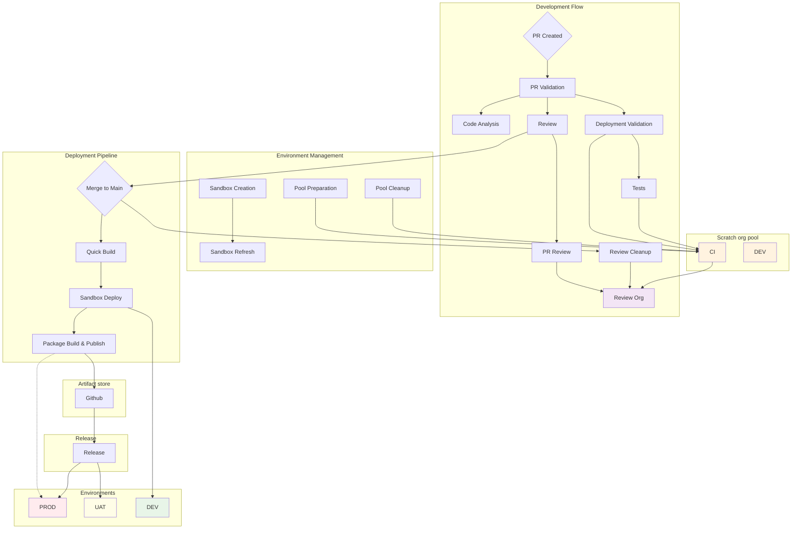

# Salesforce GitHub Actions Workflows

A comprehensive collection of reusable GitHub Actions workflows designed for Salesforce development teams following trunk-based development methodology facilitated by [sfp](https://github.com/flxbl-io/sfp). These workflows provide a complete CI/CD pipeline solution for Salesforce projects, including validation, testing, deployment, and environment management.

## 🌟 Overview

This repository contains battle-tested GitHub Actions workflows that implement industry best practices for Salesforce development, including:

- **Continuous Integration**: Automated validation and testing of pull requests
- **Environment Management**: Scratch org pools and sandbox management
- **Code Quality**: Static analysis and code quality checks
- **Deployment Automation**: Streamlined deployment to various environments
- **Review Environments**: On-demand scratch orgs for code review

Most workflows are built on top of [sfp](https://github.com/flxbl-io/sfp) and follow the trunk-based development methodology for enterprise-grade Salesforce development.

## 🏗️ Architecture Overview



## 📋 Workflow Catalog

### Core Development Workflows

#### 1. **Pull Request Validation** (`validate.yml`)
**Trigger**: `workflow_call`
**Purpose**: Validates changes in pull requests using scratch orgs from a pool

```yaml
name: PR Validation
on:
  pull_request:
    branches: [main, develop]

jobs:
  validate:
    uses: your-org/sf-actions/.github/workflows/validate.yml@main
    with:
      pool-tag: "ci"
      mode: "thorough"
      diff-check: true
    secrets:
      DEVHUB_SFDX_AUTH_URL: ${{ secrets.DEVHUB_SFDX_AUTH_URL }}
```

**Features**:
- Differential validation (only changed packages)
- Configurable validation modes (thorough, fast, individual)
- Pool-based scratch org usage
- Automatic test execution

#### 2. **Simple Validation** (`simple-validate.yml`)
**Trigger**: `workflow_call`
**Purpose**: Lightweight validation for smaller projects or quick checks

```yaml
jobs:
  simple-validate:
    uses: your-org/sf-actions/.github/workflows/simple-validate.yml@main
    with:
      source-dir: "force-app"
    secrets:
      DEVHUB_SFDX_AUTH_URL: ${{ secrets.DEVHUB_SFDX_AUTH_URL }}
```

#### 3. **Code Analysis** (`code-analysis.yml`)
**Trigger**: `workflow_call`
**Purpose**: Comprehensive static code analysis for Salesforce code

```yaml
jobs:
  code-analysis:
    uses: your-org/sf-actions/.github/workflows/code-analysis.yml@main
    with:
      diff-check: true
```

**Includes**:
- ESLint for Lightning Web Components
- Salesforce Code Analyzer
- PMD for Apex code
- Security vulnerability scanning

### Build & Release Workflows

#### 4. **Quick Build** (`quickbuild.yml`)
**Trigger**: `workflow_call`
**Purpose**: Creates packages for deployment with differential build optimization

```yaml
jobs:
  quickbuild:
    uses: your-org/sf-actions/.github/workflows/quickbuild.yml@main
    with:
      datadog: true
      newrelic: false
    secrets:
      DEVHUB_SFDX_AUTH_URL: ${{ secrets.DEVHUB_SFDX_AUTH_URL }}
      DATADOG_API_KEY: ${{ secrets.DATADOG_API_KEY }}
```

#### 5. **Deploy** (`deploy.yml`)
**Trigger**: `workflow_call`
**Purpose**: Deploys packages to target environments

```yaml
jobs:
  deploy:
    uses: your-org/sf-actions/.github/workflows/deploy.yml@main
    with:
      org-alias: "staging"
      datadog: true
    secrets:
      DEVHUB_SFDX_AUTH_URL: ${{ secrets.DEVHUB_SFDX_AUTH_URL }}
      ENV_SFDX_AUTH_URL: ${{ secrets.STAGING_SFDX_AUTH_URL }}
      DATADOG_API_KEY: ${{ secrets.DATADOG_API_KEY }}
```

#### 6. **Release** (`release.yml`)
**Trigger**: `workflow_call`
**Purpose**: Orchestrates release deployments with proper artifact management

```yaml
jobs:
  release:
    uses: your-org/sf-actions/.github/workflows/release.yml@main
    with:
      release-def-path: "config/release-definition.yml"
      org: "production"
      loglevel: "info"
    secrets:
      ENV_SFDX_AUTH_URL: ${{ secrets.PROD_SFDX_AUTH_URL }}
      DEVHUB_SFDX_AUTH_URL: ${{ secrets.DEVHUB_SFDX_AUTH_URL }}
```

### Environment Management Workflows

#### 7. **Prepare Pool** (`prepare-pool.yml`)
**Trigger**: `workflow_call`
**Purpose**: Creates and maintains scratch org pools for CI/CD

```yaml
name: Prepare CI Pool
on:
  schedule:
    - cron: '0 2 * * *'  # Daily at 2 AM

jobs:
  prepare-pool:
    uses: your-org/sf-actions/.github/workflows/prepare-pool.yml@main
    with:
      pool-tag: "ci"
      git-ref: "main"
      pool-def: "config/project-ci-pool-def.json"
    secrets:
      DEVHUB_SFDX_AUTH_URL: ${{ secrets.DEVHUB_SFDX_AUTH_URL }}
```

#### 8. **Clean Pool** (`clean-pool.yml`)
**Trigger**: `workflow_call`
**Purpose**: Cleans up expired scratch orgs from pools

```yaml
name: Daily Pool Cleanup
on:
  schedule:
    - cron: '0 4 * * *'  # Daily at 4 AM

jobs:
  clean-pool:
    uses: your-org/sf-actions/.github/workflows/clean-pool.yml@main
    with:
      pool-tag: "ci"
    secrets:
      DEVHUB_SFDX_AUTH_URL: ${{ secrets.DEVHUB_SFDX_AUTH_URL }}
```

#### 9. **Create Sandbox** (`create-sandbox.yml`)
**Trigger**: `workflow_call`
**Purpose**: Creates new Salesforce sandboxes

```yaml
jobs:
  create-sandbox:
    uses: your-org/sf-actions/.github/workflows/create-sandbox.yml@main
    with:
      definition_file: "config/sandbox-definition.json"
      sandbox_name: "UAT"
      license: "Developer"
    secrets:
      DEVHUB_SFDX_AUTH_URL: ${{ secrets.DEVHUB_SFDX_AUTH_URL }}
```

#### 10. **Refresh Sandbox** (`refresh-sandbox.yml`)
**Trigger**: `workflow_call`
**Purpose**: Refreshes existing sandboxes with latest production data

### Review & Collaboration Workflows

#### 11. **PR Review** (`pr-review.yml`)
**Trigger**: `issue_comment` (comment `/review-org`)
**Purpose**: Creates on-demand scratch orgs for code review

**Usage**: Comment `/review-org` on any pull request to get a dedicated scratch org with your changes deployed.

#### 12. **PR Review Cleanup** (`pr-review-cleanup.yml`)
**Trigger**: `pull_request` (closed)
**Purpose**: Automatically cleans up review orgs when PRs are closed

## 🚀 Getting Started

### Prerequisites

1. **DevHub org** with proper permissions
2. **GitHub secrets** configured:
   - `DEVHUB_SFDX_AUTH_URL`: DevHub authentication URL
   - Environment-specific auth URLs (e.g., `STAGING_SFDX_AUTH_URL`)
   - Optional: Monitoring service keys (Datadog, New Relic)

### Basic Implementation

1. **Create your main workflow file** (`.github/workflows/ci.yml`):

```yaml
name: CI/CD Pipeline

on:
  pull_request:
    branches: [main]
  push:
    branches: [main]

jobs:
  # Code Quality Checks
  code-analysis:
    uses: your-org/sf-actions/.github/workflows/code-analysis.yml@main

  # PR Validation
  validate:
    needs: code-analysis
    if: github.event_name == 'pull_request'
    uses: your-org/sf-actions/.github/workflows/validate.yml@main
    with:
      pool-tag: "ci"
      mode: "thorough"
    secrets:
      DEVHUB_SFDX_AUTH_URL: ${{ secrets.DEVHUB_SFDX_AUTH_URL }}

  # Build on merge to main
  quickbuild:
    if: github.event_name == 'push' && github.ref == 'refs/heads/main'
    uses: your-org/sf-actions/.github/workflows/quickbuild.yml@main
    secrets:
      DEVHUB_SFDX_AUTH_URL: ${{ secrets.DEVHUB_SFDX_AUTH_URL }}

  # Deploy to staging
  deploy-staging:
    needs: quickbuild
    uses: your-org/sf-actions/.github/workflows/deploy.yml@main
    with:
      org-alias: "staging"
    secrets:
      DEVHUB_SFDX_AUTH_URL: ${{ secrets.DEVHUB_SFDX_AUTH_URL }}
      ENV_SFDX_AUTH_URL: ${{ secrets.STAGING_SFDX_AUTH_URL }}
```

2. **Set up pool management** (`.github/workflows/pool-management.yml`):

```yaml
name: Pool Management

on:
  schedule:
    - cron: '0 2 * * *'  # Clean pools daily at 2 AM
    - cron: '0 4 * * *'  # Prepare pools daily at 4 AM

jobs:
  prepare-pool:
    if: github.event.schedule == '0 4 * * *'
    uses: your-org/sf-actions/.github/workflows/prepare-pool.yml@main
    with:
      pool-tag: "ci"
    secrets:
      DEVHUB_SFDX_AUTH_URL: ${{ secrets.DEVHUB_SFDX_AUTH_URL }}

  clean-pool:
    if: github.event.schedule == '0 2 * * *'
    uses: your-org/sf-actions/.github/workflows/clean-pool.yml@main
    with:
      pool-tag: "ci"
    secrets:
      DEVHUB_SFDX_AUTH_URL: ${{ secrets.DEVHUB_SFDX_AUTH_URL }}
```

3. **Configure project structure**:
   - Create `sfdx-project.json` with package directories
   - Set up pool definition file: `config/project-ci-pool-def.json`
   - Configure release definitions if using release workflow

## 📁 Required Configuration Files

### Pool Definition (`config/project-ci-pool-def.json`)
```json
{
  "$schema": "https://raw.githubusercontent.com/dxatscale/sfpowerscripts/0df8d78ae327d03bf5b2e965dcced459066abb83/packages/core/resources/pooldefinition.schema.json",
  "tag": "ci",
  "maxAllocation": 20,
  "expiry": 2,
  "batchSize": 5,
  "configFilePath": "config/project-scratch-def.json",
  "enableSourceTracking": false,
  "installAll": true,
  "fetchArtifacts": {
    "npm": {
      "scope": "myorg"
    }
  }
}
```

### Scratch Org Definition (`config/project-scratch-def.json`)
```json
{
  "orgName": "MyProject CI Org",
  "edition": "Developer",
  "features": ["EnableSetPasswordInApi", "MultiCurrency"],
  "settings": {
    "lightningExperienceSettings": {
      "enableS1DesktopEnabled": true
    }
  }
}
```

## 🔧 Advanced Configuration

### Monitoring Integration

SFP supports Datadog and New Relic monitoring by setting the appropriate inputs and secrets:

```yaml
jobs:
  deploy:
    uses: your-org/sf-actions/.github/workflows/deploy.yml@main
    with:
      datadog: true
      newrelic: true
    secrets:
      DATADOG_API_KEY: ${{ secrets.DATADOG_API_KEY }}
      DATADOG_HOST: ${{ secrets.DATADOG_HOST }}
      NEWRELIC_INSIGHT_INSERT_KEYS: ${{ secrets.NEWRELIC_INSIGHT_INSERT_KEYS }}
```

### Custom Validation Modes

- `thorough`: Full validation with all tests
- `fast`: Quick validation, minimal tests
- `individual`: Validate each package separately

### Environment-Specific Deployments

Create separate workflows for different environments:

```yaml
# .github/workflows/deploy-production.yml
name: Production Deployment
on:
  release:
    types: [published]

jobs:
  deploy:
    uses: your-org/sf-actions/.github/workflows/release.yml@main
    with:
      release-def-path: "config/production-release.yml"
      org: "production"
    secrets:
      ENV_SFDX_AUTH_URL: ${{ secrets.PROD_SFDX_AUTH_URL }}
      DEVHUB_SFDX_AUTH_URL: ${{ secrets.DEVHUB_SFDX_AUTH_URL }}
```

## 🛠️ Troubleshooting

### Common Issues

1. **Pool exhaustion**: Increase `maxAllocation` in pool definition or clean pools more frequently
2. **Authentication failures**: Verify SFDX auth URLs are correctly formatted and have proper permissions
3. **Build failures**: Check package dependencies and sfdx-project.json configuration

### Debug Mode

Enable debug logging by setting environment variables:
```yaml
env:
  DEBUG: true
  SFDX_LOG_LEVEL: debug
```

## 🤝 Contributing

1. Fork the repository
2. Create a feature branch
3. Make your changes
4. Test thoroughly with your Salesforce org
5. Submit a pull request

## 📄 License

This project is licensed under the MIT License - see the [LICENSE](LICENSE) file for details.

## 🔗 Related Resources

- [SFP Documentation](https://docs.flxbl.io/sfp)
- [Salesforce DX Developer Guide](https://developer.salesforce.com/docs/atlas.en-us.sfdx_dev.meta/sfdx_dev/)
- [GitHub Actions Documentation](https://docs.github.com/en/actions)

---

For questions and support, please open an issue in this repository or reach out to the maintainers.
